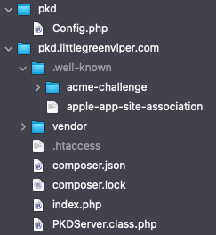

# Passkeys Demo Project

Server Implementation

## Overview

## Basic Structure

This server is implemented in [PHP](https://www.php.net), and uses a simple [MySQL](https://www.mysql.com) database. It is a basic [CRUD](https://en.wikipedia.org/wiki/Create,_read,_update_and_delete) server, allowing users to create accounts, store a small amount of information securely, then access and modify that information (also securely).

The server is implemented almost entirely in [one PHP file](./PKDServer.class.php).

## Implementation

In order to use the server, you need to set up [a LAMP server](https://en.wikipedia.org/wiki/LAMP_\(software_bundle\)), and initialize a new database, with the contents of the [`Meta/MySQLStructure.sql`](./Meta/MySQLStructure.sql) file. This creates two tables. You also need to set up a database user, and assign it to the new database, with all standard permissions (no need for admin ones, like GRANT).

You then need to set up a configuration file. This is accomplished by editing the Meta/Config.php file with the values necessary to access the server, and then placing that in another directory (we suggest one that is outside the HTTP directory path, so it can't be scanned). Edit the index.php file, so that its require line brings in the edited Config.php file.

Copy all these files (not in Meta) to your server, into the HTTP path.

    composer.json
    index.php
    PKDServer.class.php

Once you have the server code set up, use SSH or the Console, to navigate to the server directory, and enter:

    $> composer update

That will bring in the [WebAuthn PHP Library](https://github.com/lbuchs/WebAuthn), and create a directory called "vendor." Ignore that directory. The script knows what to do with it.

The basic PHP server should now be ready.

However, we also need to set up [the `apple-app-site-association` file](https://developer.apple.com/documentation/xcode/supporting-associated-domains) ([here, in the `Meta` subfolder](./Meta/apple-app-site-association)), This goes into the invisible `.well-known` directory, at the HTTP root of your server. This will be necessary, so the app can use PassKeys to interact with your server. You will also need to change the app bundle ID to match your bundle (the sample is the one used for my sample app).

When you are done, the server should look something like this (from my own example server, Yours will have different names):

In my setup, `pkd.littlegreenviper.com` is the HTTP root. Note the `pkd` directory, outside that root. It contains the `Config.php` file, and the `index.php` file looks like this:

    require_once "./PKDServer.class.php";
    require_once "../pkd/Config.php";
    new PKDServer();

The `acme-challenge` directory is used by the server's SSL implementation. Your server may or may not have it. Ignore it, and leave it alone, if it's there.

The `composer.lock` file is an artifact of the composer update. Leave it there.

The .htaccess file is not always necessary, but I found that I had to ensure that the `apple-app-site-association` file had to be explicitly coerced into presenting as JSON, so it looks like this:

    <IfModule mod_headers.c>
      <Files "apple-app-site-association">
        ForceType application/json
        Header set Content-Type "application/json"
      </Files>
      <FilesMatch "^apple-app-site-association$">
        ForceType application/json
        Header set Content-Type "application/json"
      </FilesMatch>
    </IfModule>

It's likely that your implementation should work fine, without it.

### Operation

The data stored are two strings: A "Display Name," and a "Credo."

For purposes of this demonstration, these strings are limited to 255 characters in length.

There are two database tables: One is used to strore the passkey credentials, and the other stores the actual user data that is presented and modified by the UI. The user never sees most of the passkey credential information.

The passkey is used in two places: Registration (creating an account), and logging in. After login, the server works in the same way that most of these types of things work.

### The CRUD

- **C**reate - This is how a user registers a new account. They provide a string that is used as a "tag" for the passkey that will represent the account on the server. After creating the passkey, they select that passkey, whenever they want to log in.

- **R**ead - After the user logs in, their client reads the data stored in the server, and populates the UI elements.

- **U**pdate - After the user logs in, their client allows them to change the Display Name and the Credo, to be stored on the server.

- **D**elete - After the user logs in, they can delete their entire server account.

## Requirements

- The server relies on the well-established [WebAuthn PHP Library](https://github.com/lbuchs/WebAuthn), to provide authentication services.

- The server requires a [LAMP](https://en.wikipedia.org/wiki/LAMP_\(software_bundle\)) server, with [PHP](https://www.php.net) 8 or greater, and a [MySQL](https://www.mysql.com)/[MariaDB](https://mariadb.org) database (MySQL 5.4 or greater, or equivalent MariaDB). The [SQL](https://en.wikipedia.org/wiki/SQL) is written in a very "portable" format, however, so adapting to other databases should be fairly straightforward.

## License:

### MIT License

Permission is hereby granted, free of charge, to any person obtaining a copy of this software and associated documentation
files (the "Software"), to deal in the Software without restriction, including without limitation the rights to use, copy,
modify, merge, publish, distribute, sublicense, and/or sell copies of the Software, and to permit persons to whom the
Software is furnished to do so, subject to the following conditions:

The above copyright notice and this permission notice shall be included in all copies or substantial portions of the Software.

THE SOFTWARE IS PROVIDED "AS IS", WITHOUT WARRANTY OF ANY KIND, EXPRESS OR IMPLIED, INCLUDING BUT NOT LIMITED TO THE WARRANTIES
OF MERCHANTABILITY, FITNESS FOR A PARTICULAR PURPOSE AND NONINFRINGEMENT.
IN NO EVENT SHALL THE AUTHORS OR COPYRIGHT HOLDERS BE LIABLE FOR ANY CLAIM, DAMAGES OR OTHER LIABILITY, WHETHER IN AN ACTION OF
CONTRACT, TORT OR OTHERWISE, ARISING FROM, OUT OF OR IN CONNECTION WITH THE SOFTWARE OR THE USE OR OTHER DEALINGS IN THE SOFTWARE.
